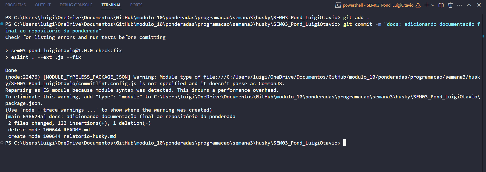
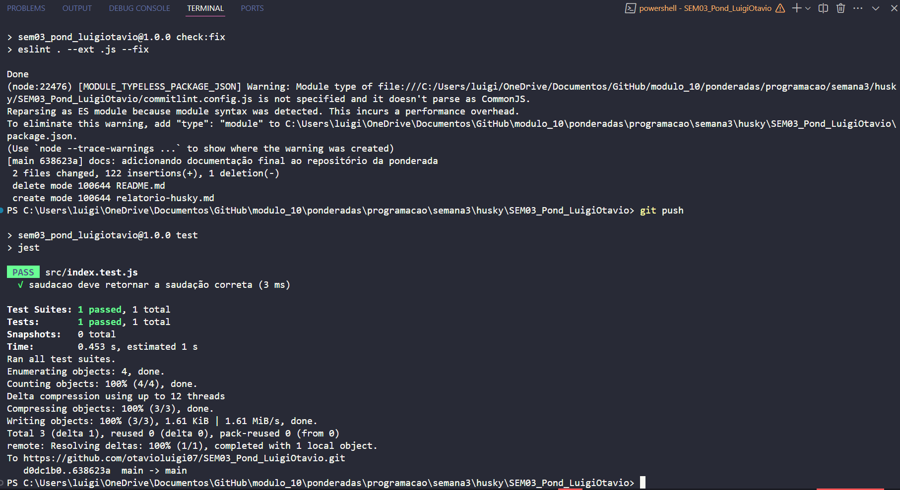

# SEM03_Pond_LuigiOtavio

# 📄 Relatório - Configuração do Husky
&nbsp;Husky é uma ferramenta que permite configurar Git hooks de forma simples e eficiente em projetos. Ele garante que certos scripts sejam executados automaticamente em momentos específicos do ciclo de versionamento, como antes de um commit ou push.

## 🧠 Objetivo
&nbsp;O objetivo desta atividade foi configurar o Husky em um repositório GitHub para garantir que, antes de qualquer commit ou push:

- O código compile corretamente.
- Os testes sejam executados com sucesso.
- As boas práticas de codificação sejam seguidas.

# ⚙️ Configurações Realizadas
*✅ Instalação de dependências*

``` sh

npm init -y
npm install husky --save-dev
npx husky install
npm set-script prepare "husky install"
npm run prepare

```

*✅ Adição dos scripts ao package.json*
``` json
"scripts": {
  "prepare": "husky install",
  "test": "jest",
  "check:fix": "eslint . --ext .js --fix"
}

```

*✅ ESLint configurado (usando eslint.config.mjs)*
``` js

import js from "@eslint/js";
import globals from "globals";
import jest from "eslint-plugin-jest";
import { defineConfig } from "eslint/config";

export default defineConfig([
  {
    files: ["**/*.{js,mjs,cjs}"],
    plugins: { js },
    extends: ["js/recommended"],
  },
  {
    files: ["**/*.{js,mjs,cjs}"],
    languageOptions: {
      globals: {
        ...globals.node,
        ...globals.jest,
      },
    },
    plugins: { jest },
  },
]);


```

*✅ Commitlint configurado*
``` sh

npm install --save-dev @commitlint/{config-conventional,cli}
echo "module.exports = {extends: ['@commitlint/config-conventional']}" > commitlint.config.js

```

# 🧪 Hooks do Husky
&nbsp;Git hooks são gatilhos fornecidos pelo Git que permitem executar scripts personalizados em determinados eventos, como:

`pre-commit: antes de um commit ser realizado.`
`commit-msg: logo após a mensagem de commit ser escrita.`
`pre-push: antes de enviar código para o repositório remoto.`

*pre-commit*
``` sh
#!/usr/bin/env sh
. "$(dirname -- "$0")/_/husky.sh"

echo 'Check for listing errors and run tests before comitting'
npm run check:fix || (echo 'Something does not worked' && exit 1)

echo 'Done'
```

*commit-msg*
``` sh
#!/usr/bin/env sh
. "$(dirname -- "$0")/_/husky.sh"

npx --no -- commitlint --edit $1
```

*pre-push*
``` sh
#!/usr/bin/env sh
. "$(dirname -- "$0")/_/husky.sh"

npm test

```

# ✅ Teste Criado
&nbsp;Esse teste foi criado para testar a função "saudacao", uma função que retorna uma saudação para o usuário.

``` js
// src/index.test.js
import { saudacao } from "./index.js";

test("saudacao deve retornar mensagem com nome", () => {
  expect(saudacao("Luigi")).toBe("Olá, Luigi!");
});
```

# Screenshots

&nbsp;Na imagem a seguir, dois hooks são ativados: pre-commit e commit-msg. Pre-commit verifica os erros do código e os corrige se forem considerados básicos. Entretanto, apenas para arquivos com final .js - configuração feita por mim. Já o commit-msg, verifica o padrão da mensagem do commit. Esse padrão, deve seguir os critérios do " commitlint-config-conventional (based on the Angular convention)".



&nbsp;Por último, o pre-push. Esse hook roda todos os arquivos jest .js no repositório. O push só feito se todos os testes passarem.



# ✅ Conclusão
&nbsp;A configuração do Husky nesta atividade permitiu integrar boas práticas ao fluxo de desenvolvimento de forma automatizada. Com os hooks pre-commit, commit-msg e pre-push, garantimos que:

- O código seja analisado e corrigido automaticamente com o ESLint;
- As mensagens de commit sigam um padrão semântico com o Commitlint;
- Os testes sejam executados automaticamente antes de qualquer push para o repositório remoto.

&nbsp;Essa automação contribui diretamente para a qualidade, padronização e confiabilidade do código enviado ao repositório, refletindo um processo de desenvolvimento mais profissional e robusto.